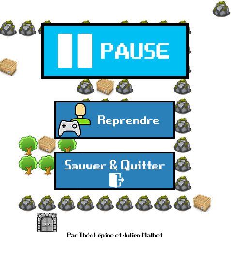

# Bomberman-like game: "Bombeirb"

This project was made in collaboration with Julien MATHET as school project.
Bombeirb is a 2D game written in C and using the SDL library.

## Rules of the game

You must free the princess from its castle. To do so you can move using keyboard arrows, to move around the map. The wooden boxes can be moved or destroyed using bombs. You should avoid monsters to stay alive or destroy them using bombs.

## Assessment

This 3-month project is now finished and was assessed by our teachers. A technical summary and functionalities overview can be found (in French) in the PDF report inside this repo.

# Screenshots

